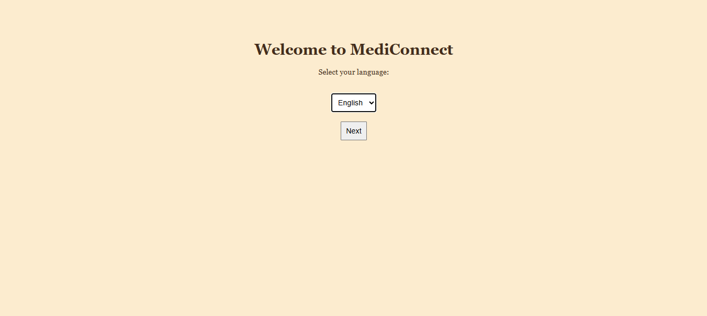
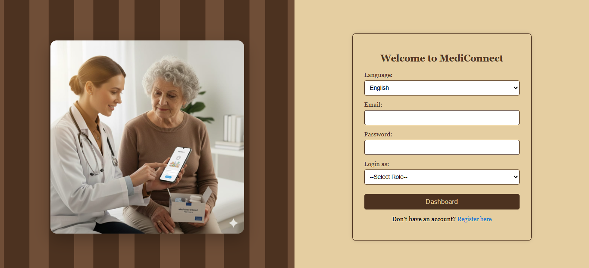
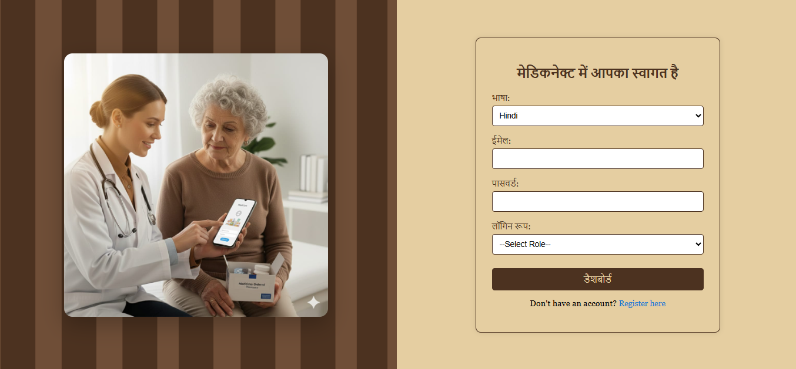
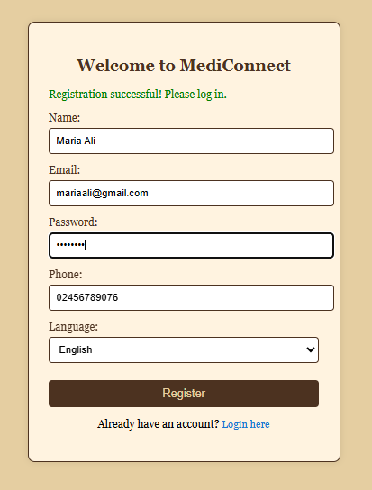
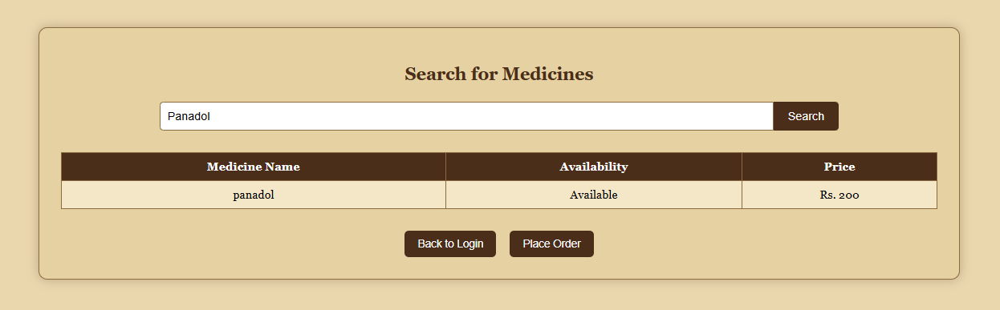
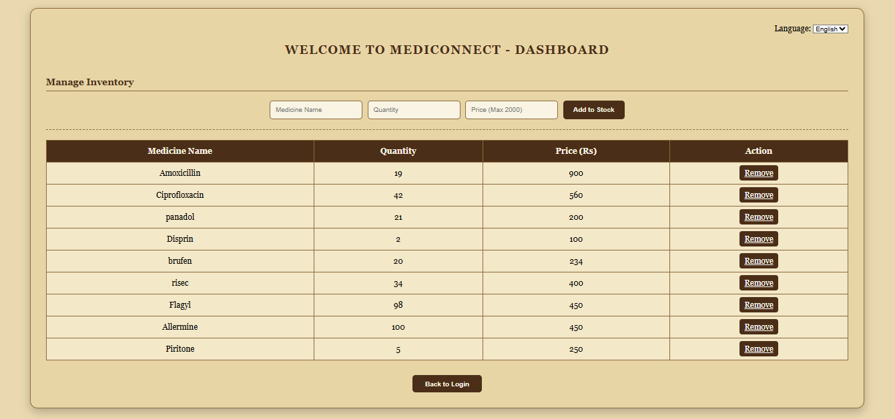
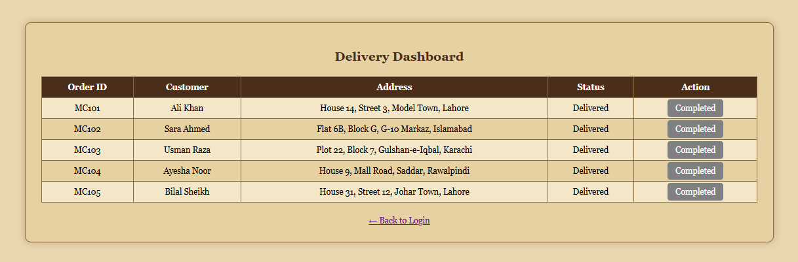
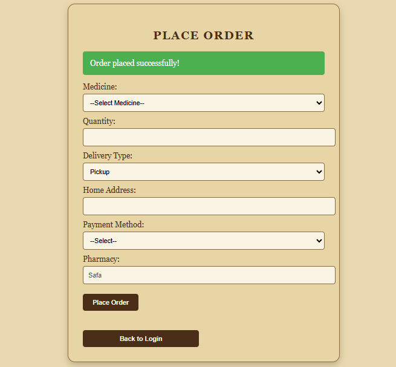

# MediConnect
Built in team collaboration
## 🏥 Healthcare Medicine Delivery Web App

Mediconnect is a multi-role healthcare web application that connects patients, pharmacies, and delivery agents on a single platform.

The system allows patients to search and order medicines, pharmacies to manage stock, and delivery agents to manage and complete deliveries.

## ✨ Features
- Multi-language availability : English, Hindi and Tamil
-First page displays language choosing option then the app functions in that language.

### 👤 Patient Role
- User registration and login  
- Search medicines  
- Place medicine orders  
- Add delivery address / pickup details  
- Select payment method  

### 💊 Pharmacy Role
- Secure login access  
- Add, update, and remove medicine stock  
- Manage medicine availability  

### 🚚 Delivery Agent Role
- Delivery dashboard access  
- View assigned orders  
- Mark deliveries as completed  

### 🔐 System Features
- Multi-role authentication system  
- Database-driven operations  
- Responsive UI design

## 🛠 Tech Stack

- HTML  
- CSS  
- JavaScript  
- PHP  
- XAMPP (MySQL Database)

## 📸 Screenshots

### 🏥 Main Language Selection Page
Users can select their preferred language before accessing the platform. This improves accessibility for different users.

### 🇬🇧 English Interface
The application interface displayed in English language for better user accessibility.

### 🇮🇳 Hindi Interface
Users can switch to Hindi language interface for better usability.

### 🇮🇳 Tamil Interface
Supports Tamil language interface for regional users.

---

### 👤 Patient Registration Page
Patients can create accounts by providing personal details to access medicine ordering services.

### 👤 Patient Dashboard
Patients can:
- Search medicines
- View available medicines
- Place orders
- Add delivery details

### 💊 Pharmacy Dashboard
Pharmacy users can:
- Add new medicines
- Update medicine stock
- Remove unavailable medicines
- Manage inventory

### 🚚 Delivery Dashboard
Delivery agents can:
- View assigned deliveries
- Track orders
- Mark deliveries as completed

---

### 🛒 Order Confirmation Page
Shows order summary after successful purchase and confirms order placement.

## 🌟 Project Highlights
- Multi-role authentication system  
- Multi-language interface support  
- Real-time medicine ordering system  
- Database-driven architecture  
- Responsive user interface design  

## ⚙️ Installation
1. Install XAMPP  
2. Clone or download repository  
3. Move project folder to XAMPP htdocs directory  
4. Start Apache and MySQL from XAMPP Control Panel  
5. Import database file into phpMyAdmin  
6. Open project in browser  

## 📬 Contact
Email: hamnamahmood004@gmail.com  
GitHub: github.com/hamna-mahmood  
